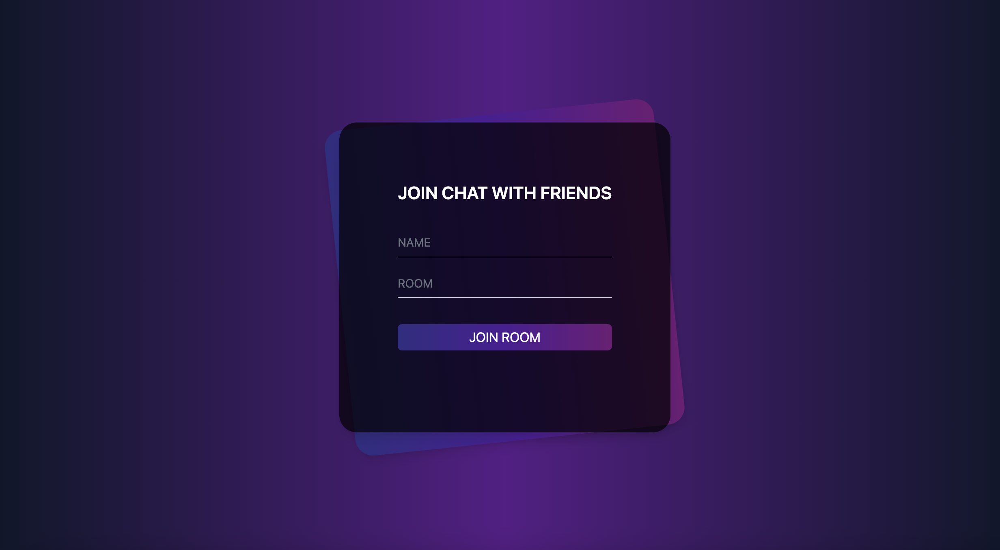
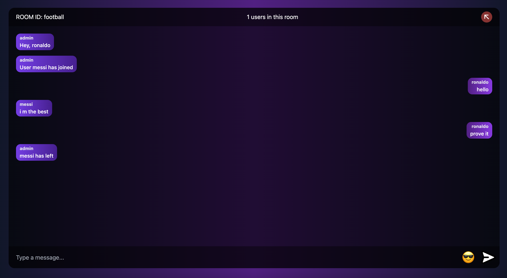

# SocketIO Chat

> Simple chat app with rooms made with ReactJS, Express, Socket.io

## Preview




## Features

### Client

- ReactJS
- React-router-dom
- ESLint

### Server

- ExpressJS
- Socket.io
- ESLint

## Client setup

```
npm install
```

```
npm run start

```

## Server setup

```

npm install

```

```
npm run dev

```

## Contributing

Contributions, feedback and issues are welcome. Feel free to fork, comment, critique, or submit a pull request.
